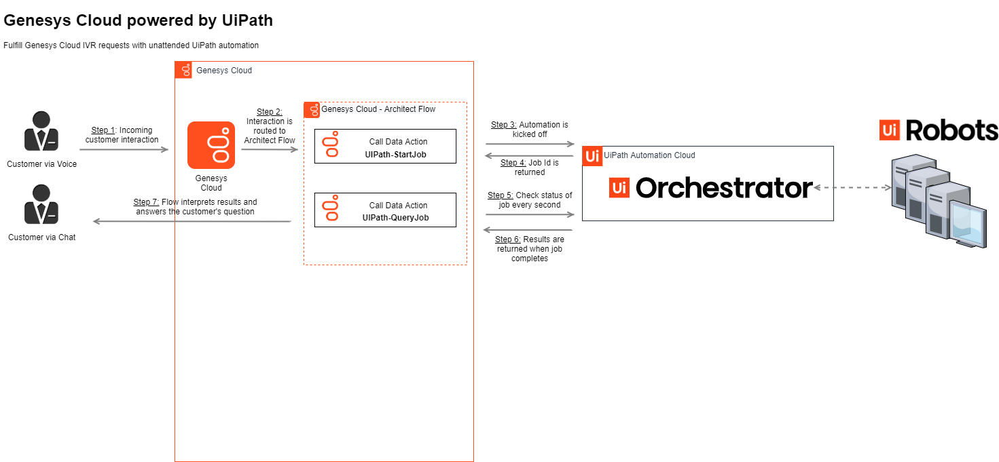

# Genesys Cloud powered by UiPath

IVR (&quot;Interactive Voice Response&quot;) systems are often the first point of contact for customers as part of an enterprise&#39;s contact care system. Unfortunately, IVRs often fall short on the promise of providing &quot;self-service&quot; solutions for customers as IVRs are only capable of connecting to systems that are accessible via API, which even when available can be expensive to implement such solutions.

With UiPath&#39;s Robotic Process Automation (RPA) platform, [Genesys Cloud](https://www.genesys.com/genesys-cloud) can be connected to any system via RPA, drastically expanding IVR fulfillment capabilities to gather information and perform actions across a plethora of systems from on-prem mainframes to cloud-based web services. Increasing the success rate of customer requests being fulfilled by the self-service IVR frees your contact center agents up to work on more complex customer issues. The results? Improved customer and employee experiences, enhanced accuracy, reduced Average Handling Time (&quot;AHT&quot;), and acceleration of your digital transformation initiatives, resulting in a rapid return on investment.

The UiPath Enterprise Platform connects Genesys Cloud to any system, including those not previously accessible via Genesys Cloud. This enables a zero-touch, fully automated contact center solution and complete customer self-service, freeing up agents to work on more complex customer issues.​ This integration services all regions where Genesys Connect is available globally across Americas, EMEA, and APAC.

## Key Features

- **Integrate with all applications with UiPath UI automation and native integrations**. UiPath world-class UI automation capabilities enables automation of any application, browser, or virtual environment. Leveraging UI automation or native integrations, UiPath integrates with any system that your contact center relies on, including systems previously not accessible by Genesys Cloud​
- **Seamlessly transfer requests from self-service to contact center agent with human-in-the-loop.** UiPath robots can be leveraged for a seamless handoff from a self-service IVR channel to a live agent, helping agents solve customer problems faster, reduce AHT, and improve satisfaction.
- **Quickly scale to adjust to business needs.** From small automation projects to company-wide extensive scopes, UiPath Orchestrator and UiPath Robots can quickly scale alongside Genesys Cloud to meet any enterprise need for normal business cycles or unplanned spikes in call volume in your contact center.

## Benefits

- **Empower agents to focus on complex issues** : the UiPath integration with Genesys Cloud increases request fulfillment success rates in the self-service IVR, freeing contact center agents to work on more complex customer issues.​
- **Realize rapid ROI** : Streamlined integration capabilities, easy-to-use customizable automation templates and an intuitive UI in UiPath Studio ensure fast deployment and a quick return on investment (ROI) alongside your Genesys Cloud instance.​​
- **Improve customer &amp; employee satisfaction** : With UiPath and Genesys Cloud, customers and employee requests are resolved quickly, thereby boosting CSAT and NPS.​



## Demo: Fulfilling IVR requests with UiPath automation

Aileen is a customer of Meeple Telco and wants to know the current balance for her mobile phone bill. She makes a voice call to her Meeple Telco customer service number and the IVR flow queries the back-end for her last bill date and total. Aileen is thrilled that she was able to answer her question in under 30 seconds and without having to talk to anyone!

## Deployment Steps

### Step 1. Create &amp; configure your UiPath Cloud instance

1. Create a [new UiPath cloud instance](https://platform.uipath.com/portal_/register), or [use an existing instace](https://cloud.uipath.com/)
1. Download the sample processes [in this repo](https://github.com/UiPath/AmazonConnect/tree/master/processes), or use your own processes
   - BillLookup - an unattended automation that takes a phone number as input and returns the last monthly bill details
1. Publish the processes from Studio to Orchestrator - [HowTo](https://docs.uipath.com/orchestrator/docs/publishing-a-project-from-studio-to-orchestrator)
1. Deploy the processes - [HowTo](https://docs.uipath.com/orchestrator/docs/managing-processes)
1. Generate a user key and client ID for your cloud instance - [HowTo](https://docs.uipath.com/cloudplatform/docs/about-api-access)
1. Note down the following information as it will be needed in later steps:
   - User Key
   - Client Id
   - Account logical name
   - Tenant logical name

### Step 2. Prepare an Amazon Connect instance

1. Sign in to your AWS account at https://aws.amazon.com with an AWS Identity and Access Management (IAM) user role that has the necessary permissions.
1. If you don&#39;t already have an Amazon Connect instance, see the [AWS documentation](https://docs.aws.amazon.com/connect/latest/adminguide/amazon-connect-get-started.html) for information on how to create an Amazon Connect instance.

### Step 3. Run the CloudFormation Template

To make things easy to deploy, we&#39;ve hosted the default template in UiPath&#39;s S3 bucket so all you have to do is create a new stack with it. Alternatively, you can customize the [template in this repo](https://github.com/UiPath/AmazonConnect/blob/master/aws-cft/contact-center-cft).

1. Open the [AWS CloudFormation Stack creator](https://us-west-2.console.aws.amazon.com/cloudformation/home?region=us-west-2#/stacks/quickcreate?templateURL=https://uipath-contactcenter.s3-us-west-2.amazonaws.com/AmazonConnect/IVR/contact-center-cft)
1. Set the region to the same region as your Amazon Connect instance. _NOTE: The AWS Lambda functions must be in the_ _same region as your Cloud organization. For more information, see _[_AWS regions for Cloud deployment_](https://help.mypurecloud.com/?p=162751)_._
1. Fill in the form with the pertinent data
   - Stack Name - provide a name for your stack
     - EXAMPLE: UiPath-AmazonConnect
   - User Key - provide the UserKey name from step 1.6 above
     - EXAMPLE: GHFabdDEfGHiJkLm0N1QrS2t-3u4vw\_XyZ5AB-6cde7Fg
   - Account Logical Name - provide the account name from step 1.6 above
     - EXAMPLE: MyAccountName
   - Tenant Logical Name - provide the tenant name from step 1.6 above
     - EXAMPLE: MyOrchestrator
   - Client Id - provide the clientId name from step 1.6 above
     - EXAMPLE: 8DEv1AMNXczW3y4U15LL3jYf62jK93n5
   - S3 Bucket - _NOTE: this must be all lowercase_
     - EXAMPLE: uipath-amazonconnect-contactflows
1. Continue pressing **Next** for 2 screens.
1. Check the **I acknowledge...** checkbox and finally click **Create Stack**. It should take less than 2 minutes for all the resources to be created.
1. When the stack creation is complete, navigate to the Resources tab and click on the Physical ID of the following Lambda functions:
   - UiPathQueryJob
   - UiPathStartJob
1. Note down the ARNs from the top right of the page. This will be needed in Step 3.1 below.

Here&#39;s an example of the completed form:


### Step 4. Grant Genesys Cloud access to call the AWS Lambda functions

1. Create an IAM resource to invoke AWS Lambda functions per the [Genesys Cloud documentation](https://help.mypurecloud.com/articles/create-iam-resources-to-invoke-an-aws-lambda-function/).

### Step 5. Create the AWS Lambda Data Actions in Genesys Cloud

1. Add an AWS Lambda data action integration to your instance per the [Genesys Cloud documentation](https://help.mypurecloud.com/articles/add-a-data-actions-integration/).
1. Create the AWS Lambda data action for both of the AWS Lambda functions by importing the JSON located in the [CustomActions folder](./CustomActions) per the [Genesys Cloud documentation](https://help.mypurecloud.com/articles/import-or-export-a-data-action-for-integrations/). Be sure to select the integration you created in step 4.2 above.
   - UiPathQueryJob – CustomActions\UiPath-QueryJob.custom
   - UiPathStartJob - CustomActions\UiPath-StartJob.custom
1. After importing the data actions, update the ARN to the point to the newly created AWS Lambda function from Step 3.6 above.
   1. Click on the Setup Tab of the newly created action
   1. Click on the Configuration Tab
   1. Paste the ARN from Step 3.6 above into the &quot;Request URL Template&quot; textbox.
   1. Click Save &amp; Publish
1. [Optional] Change the UiPath-QueryJob data action to match the output of the job you intend to call.
   1. Update the Output Contract on the Contracts Tab to include named properties for each output argument of the UiPath process
   1. Update the Response on the Configuration Tab to map the outputs to these properties.

### Step 6. Create the Architect flows in Genesys Cloud

1. Open the Genesys Cloud Architect page at [https://apps.myCloud.com/architect/#/inboundcall/flows](https://apps.mypurecloud.com/architect/#/inboundcall/flows)
1. Import the sample flow, located in the [ArchitectFlows folder](.ArchitectFlows), as a new Flow in Architect per the [Genesys Cloud documentation](https://help.mypurecloud.com/articles/import-export-call-flow).
1. Navigate to the Get Bill action.
1. Update the flow to point to the newly created data actions
   1. Change the category to the integration you created in Step 5.1
   1. Change the data action to the data action you created in Step 5.2. _NOTE: If it does not appear in the list, make sure you published it in Step 5.2.4._
   1. Change the releaseKey and folderId inputs
      - #15 Start Job
        - releaseKey - provide the GUID for the process to run, [see below](#obtaining-a-release-key)
        - folderId - provide the ID for the Orchestrator folder, [see below](#obtaining-the-folder-id)
      - #23 Query Job
        - folderId - provide the ID for the Orchestrator folder, [see below](#obtaining-the-folder-id)

1. Publish the completed flow per the [Genesys Cloud documentation](https://help.mypurecloud.com/articles/publish-call-flow/).

### Step 7. Configure &amp; test your flows

1. To Test the flow, open up the phone dialer and call the flow directly. The format to dial is Name@localhost where Name is the name of the flow with spaces replaced by &quot;%20&quot;. For example, I&#39;ve called my flow &quot;UiPath Demo&quot; so I would call &quot;UiPath%20Demo@localhost&quot; to test the flow.

### Obtaining the folder id

The Folder Id represents the Orchestrator folder your processes are stored in.
1. Open up a browser and sign into your [Cloud Orchestrator instance](http://cloud.uipath.com/)
1. Navigate to https://cloud.uipath.com/ACCOUNT/TENANT/odata/Folders where ACCOUNT is your account name and tenant is your tenant name (see step 2.6 above). This will return a JSON blob like the following:

```
{
  "@odata.context": "https://cloud.uipath.com/ACCOUNT/TENANT/odata/$metadata#Folders",
  "@odata.count": 2,
  "value": [
    {
      "DisplayName": "Default",
      "FullyQualifiedName": "Default",
      "FullyQualifiedNameOrderable": "Default",
      "Description": null,
      "ProvisionType": "Manual",
      "PermissionModel": "InheritFromTenant",
      "ParentId": null,
      "IsActive": true,
      "Id": 12345
    },
    {
      "DisplayName": "HR",
      "FullyQualifiedName": "HR",
      "FullyQualifiedNameOrderable": "HR",
      "Description": null,
      "ProvisionType": "Manual",
      "PermissionModel": "InheritFromTenant",
      "ParentId": null,
      "IsActive": true,
      "Id": 67891
    }
  ]
}
```
3. Take the Id field for the folder your processes are stored in. The DisplayName is likely &#39;Default&#39; like in the example above.

### Obtaining a release key

We have provided a helper Lambda function, UiPathQueryRelease, for converting a process name into the release key GUID. You can [manually run the lambda from the Lambda Console](https://docs.aws.amazon.com/lambda/latest/dg/getting-started-create-function.html) to get the value you need to provide in the contact flow configuration in step 4.3. The simplest approach is to create a new test event based on the _connect-contact-flow-event_ event template. Below is an example of the input you need to pass the lambda. Note that the process name passed in must match the name found in Orchestrator.

##### Input Format
```
{
  "Name": "ContactFlowEvent",
  "Details": {
    "ContactData": {
      "ContactId": "NONE"
    },
    "Parameters": {
        "folderId": "YOUR_FOLDER_ID",,
        "processName": "PROCESSNAME"
    }
  }
}
```

##### Input Example

```
{
  "Name": "ContactFlowEvent",
  "Details": {
    "ContactData": {
      "ContactId": "NONE"
    },
    "Parameters": {
        "folderId": "12345",
        "processName": "BillLookup_MyEnvironment"
    }
  }
}
```

To post feedback, submit feature ideas, or report bugs, use the Issues section of this GitHub repo.